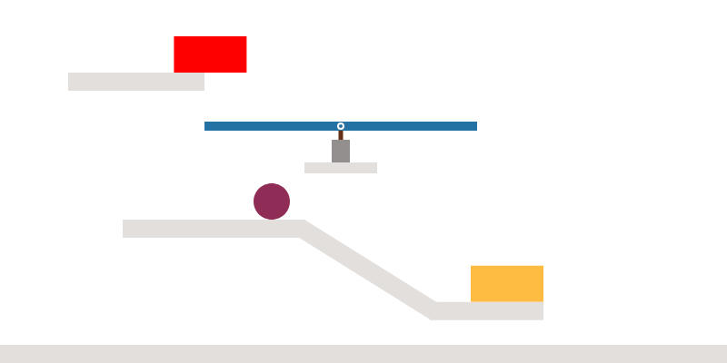
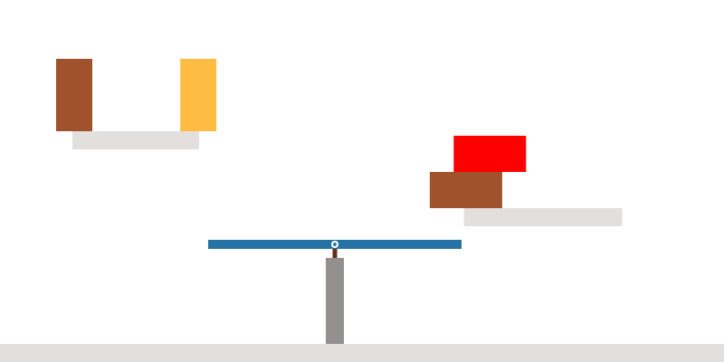
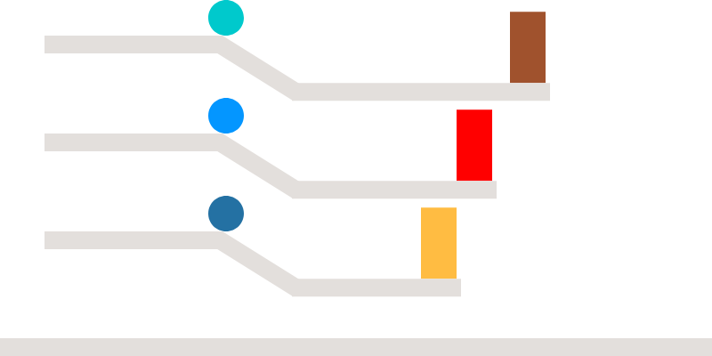

```{r, warning=FALSE, message=FALSE, include=FALSE}
library(ggforce)
library(here)
library(tidyverse)
source(here("R", "utils.R"))
source(here("R", "utils-exp2.R"))

N_trials <- list(train=15, test=18, color_vision=8);

# data_dir <-  here("data", "test-runs")
data_dir <- here("data", "prolific")

# result_dir <- here("data", "test-runs", "results", "experiment2")
result_dir <- here("data", "prolific", "results", "experiment2")

fn <- "exp2_tidy.rds"

data <- readRDS(paste(result_dir, fn, sep=.Platform$file.sep))

stimuli <- data$test %>% pull(id) %>% unique()
N_participants <- data$test %>% pull(prolific_id) %>% unique() %>% length()

plot_dir <- paste(result_dir, "plots", sep=.Platform$file.sep);
dir.create(plot_dir, showWarnings = FALSE)
```


## Training data

A few examples of train trials, to see why certain answers are not expected
at all.

**if1_ac0: not red, but yellow**

```{r if_ac0, echo=FALSE, out.width="50%", fig.align='center'}

```

**if2_ssw0: not yellow, but red**

```{r fig_ssw0, echo=FALSE, out.width="50%", fig.cap="", fig.align='center'}

```

**ramp_distance1: red, but not yellow**

```{r fig_distance1, echo=FALSE, out.width="50%", fig.cap="", fig.align='center'}

```

Events that should **NOT** be selected:

```{r training, echo=FALSE}
dat.train <- data$train %>% group_by(prolific_id, id) %>%
  mutate(across(where(is.factor), as.character)) %>%
  mutate(response = as.logical(response))

# distance1: red, ¬yellow
# distance0: yellow, ¬red
# ac0: yellow, ¬red
# ac1: red, ¬yellow
# ac2: yellow, ¬red
# ac3: red, ¬yellow
# ssw0: red, ¬yellow
# ssw1: yellow, ¬red
N = dat.train$prolific_id %>% unique() %>% length()
df.train <- dat.train %>%
  filter((id=="distance1" & question=="r" & response) |
         (id=="distance0" & question=="y" & response) |
         (id=="ac0" & question=="y" & response) |
         (id=="ac1" & question=="r" & response) |
         (id=="ac2" & question=="y" & response) |
         (id=="ac3" & question=="r" & response) |
         (id=="ssw0" & question=="r" & response) |
         (id=="ssw1" & question=="y" & response)) %>%
  group_by(id) %>% 
  mutate(n=n(), ratio=n/N) %>%
  select(expected, id, question, n, ratio, prolific_id)
  
df.train %>%
  distinct(id, .keep_all = TRUE) %>%
  ggplot(aes(x=id, y=ratio)) +
  geom_bar(aes(fill=question), stat="identity", position="dodge") +
  labs(x="trial id", y="ratio participants")

df.train.participants <- df.train %>%
  group_by(prolific_id) %>% 
  mutate(n=n()) %>%
  distinct(prolific_id, .keep_all = TRUE)

df.train.participants %>%
  ggplot(aes(y=prolific_id, x=n)) +
  geom_bar(stat="identity") +
  labs(x="# train trials where unexpected event chosen")
```

## Experimental data: Produced sentences

filter data first wrt results in train data

```{r}
ids_out_train = df.train.participants %>% filter(n>=4) %>%
  pull(prolific_id) %>% as.character()

# summarize uttterances: use 'and' instead of 'but' everywhere
dat.test <- data$test %>%
 mutate(across(where(is.factor), as.character),
        response= case_when(str_detect(response, "but") ~
                              str_replace(response, "but", "and"),
                            TRUE ~ response))
df.test <- dat.test # %>%
  # filter(!prolific_id %in% ids_out_train);
```

standardize sentences (the green and the blue = the blue and the green, etc.)

```{r standardize}
s.pos.and = "the blue block and the green block fall"
s.neg.and = "neither the blue block nor the green block fall"
s.pos.if_green = "if the green block falls the blue block falls"
s.pos.if_blue = "if the blue block falls the green block falls"
s.pos.prob_green = "probably the green block falls"
s.pos.prob_blue = "probably the blue block falls"
s.pos_neg.and_gb = "the green block falls but the blue block does not fall"
s.pos_neg.and_bg = "the blue block falls but the green block does not fall"

test.standardized <- df.test %>%
  summarize_utts(c("and"), c("does not"), s.pos.and) %>%
  summarize_utts(c("neither"), c("does not"), s.neg.and) %>%
  summarize_utts(c("if the green block"), c("does not"), s.pos.if_green) %>%
  summarize_utts(c("if the blue block"), c("does not"), s.pos.if_blue) %>%
  summarize_utts(c("the green block probably"), c("does not"), s.pos.prob_green) %>%
  summarize_utts(c("the blue block probably"), c("does not"), s.pos.prob_blue) %>%
  summarize_utts(c("and", "the green block falls", "the blue block does not"), c(),
                 s.pos_neg.and_gb) %>%
  summarize_utts(c("and", "the blue block falls", "the green block does not"), c(),
                 s.pos_neg.and_bg) %>%
  mutate(response=case_when(str_detect(response, "neither") ~ "neither block falls",
                            str_detect(response, 'and') ~ "both blocks fall",
                            TRUE ~ response))
utterances <- test.standardized %>% 
  select(response) %>% unique()
utterances
```

```{r all-trials, echo=FALSE, warning=FALSE}
plotTrials <- function(dat, trials="all", min=0, responses="all", dat.model=tibble()){
  ids = dat$id %>% unique()
  n = ids %>% length();
  brks=seq(0, 1, by=0.1)
  
  dat <- dat %>% filter(ratio>min)
  if(trials=="all"){
    for(i in seq(1, n)) {
      df <- dat %>% filter(id == ids[[i]]) %>%
        mutate(response=fct_reorder(response, desc(-ratio)))
      p <- df %>% filter(id == ids[[i]]) %>%
        ggplot(aes(x=ratio, y=response)) +
        geom_bar(stat="identity") +
        theme_bw() +
        theme(text = element_text(size=22),
              axis.text.x=element_text(angle=45, vjust = 0.5)) +
        labs(x="ratio participants", y="response", title = ids[[i]]) +
        scale_y_discrete(labels = function(ylab) str_wrap(ylab, width = 27.5))
      if(nrow(dat.model) != 0){
       p <- p + 
        geom_point(data=dat.model %>% filter(endsWith(id, ids[[i]])),
                   aes(x=ratio, y=response, color=cn), shape='*', size=10, alpha=0.5)
      }
      ggsave(paste("plots/", ids[[i]], ".png", sep=""), p, width=8, height=10)

      print(p)
    }
  } else if(responses != "all") {
      dat <- dat %>%
        filter(response %in% responses) %>%
        group_by(id) %>% summarize(ratio=sum(ratio)) %>%
        add_column(response = "literal/probably+literal") %>%
        mutate(response = as.factor(response))
    
    # if(trials != "all"){
    #   dat <- dat %>%
    #     filter(str_detect(id, trials))
    # }
    p <-  dat %>%
      mutate(response=fct_rev(fct_relevel(response, sort))) %>% 
      ggplot(aes(x=ratio, y=response)) +
      geom_bar(aes(fill=id), stat="identity", position=position_dodge(preserve="single")) +
      theme_bw() +
      theme(text = element_text(size=22),
            axis.text.x=element_text(angle=45, vjust = 0.5),
            legend.position="top") +
      labs(x="percentage of participants who built utterance", y="built utterance") +
      scale_y_discrete(labels = function(ylab) str_wrap(ylab, width = 27.5))
    print(p)
  }
}
```

## Responses per trial

Load qualitative model data

```{r model-qualitativ}
test.empirical <- test.standardized %>%
  filter(id != "ind2") %>%
  group_by(id,response) %>%
  summarize(n=n(), .groups='drop_last') %>%
  mutate(N=sum(n), ratio=n/N) %>% 
  select(id, response, ratio) %>%
  add_column(predictor="empirical")

trials = test.empirical$id %>% unique() 
test.model =
  readRDS(here("data", "speaker-predictions-means-stimuli.rds")) %>%
  rename(ratio=avg, id=stimulus) %>% 
  add_column(predictor="model") %>%
  filter(!endsWith(id, "if1_ul") & !endsWith(id, "if1_hl") & !endsWith(id, "if1_hu") &
    !endsWith(id, "if1_lu") & !endsWith(id, "if1_ll") & ratio>0)

model.if1_uh = test.model %>% filter(id=="if1_uh")
model.if2_ul = test.model %>% filter(id=="if2_ul")

test.model <- test.model %>% 
  bind_rows(model.if1_uh %>% mutate(id="if1_u-Hh")) %>%
  bind_rows(model.if1_uh %>% mutate(id="if1_u-Lh")) %>%
  bind_rows(model.if2_ul %>% mutate(id="if2_u-Hl")) %>%
  bind_rows(model.if2_ul %>% mutate(id="if2_u-Ll"))
  
```


**Independent Trials**

```{r independent-trials, echo=FALSE, fig.height=9}
test.empirical %>%
  filter(str_detect(id, "independent")) %>%
  plotTrials(dat.model=test.model %>% filter(str_detect(id, "independent")))
```

**If1-trials**

```{r if1-trials, echo=FALSE, fig.height=7}
test.empirical %>%
  filter(str_detect(id, "if1")) %>%
  plotTrials(dat.model=test.model %>% filter(str_detect(id, "if1")))
```

**If2-trials**

```{r if2-trials, echo=FALSE, fig.height=7}
test.empirical %>% group_by(id) %>%
  filter(str_detect(id, "if2")) %>%
  plotTrials(dat.model=test.model %>% filter(str_detect(id, "if2")))
```

## Responses that only contain 1 block

```{r resp-independent, echo=FALSE}
literals <- utterances %>% filter(!str_detect(response, "and|neither|but|if")) %>% 
  pull(response)
df <- test.empirical %>% group_by(id)
df %>% filter(str_detect(id, "if1")) %>%
  plotTrials(trials="", min=0, responses=literals, dat.model=test.model %>% filter(str_detect(id, "if1")))

df %>% filter(str_detect(id, "if2")) %>%
  plotTrials(trials="", min=0, responses=literals, dat.model=test.model %>% filter(str_detect(id, "if2")))
```

Did participants get the relationship between both blocks in the if2-trials?

```{r if2-trials-relation, include=FALSE}
test.standardized %>% group_by(id) %>%
  filter(
    # id == "if2_ul" &
    str_detect(id, "if2")
  ) %>% select(id, response, custom_response)
  
```

- 2 cases were green was thought (if2_hl/if2_hh) not to count as falling, because it stays on the platform
although it falls off another block (see custom response).


```{r, include=FALSE}
# All trials 
test.standardized$id %>% unique()
```

## Trials in which conditionals were built. 

```{r generated-if, echo=FALSE}
test.standardized.ifs <-
  test.standardized %>%
  filter(str_detect(response, "if")) %>%
  select(id, response, prolific_id) %>%
  group_by(id) %>% mutate(n=n()) %>% arrange(desc(n)) %>%
  select(id, n) %>% distinct()

test.standardized.ifs

participants.used_if = test.standardized %>%
  filter(str_detect(response, "if")) %>% select(prolific_id) %>% unique()
participants.nb.used_if = nrow(participants.used_if)
trials.nb_if = test.standardized.ifs %>% pull(n) %>% sum()

```

Nb of participants who created if-sentences: `r participants.nb.used_if`.
Nb of total created if-sentences: `r trials.nb_if`.

## Responses that were created most often for each trial

```{r, fig.width=10, height=12}
test.std.max = test.standardized %>% group_by(id, response) %>%
  summarize(n=n(), .groups='drop_last') %>%
  filter(n==max(n)) %>%
  mutate(id=as.factor(id), response = as.factor(response))
```

**Independent trials**

- independent_hl is strange (participants are uncertain whether or not second block
(here green block) falls, situation where block is completely on platform which 
was not shown in training phase...!)
- too certain about what is supposed to be uncertain! (ul, uh)

```{r max-independent}
test.std.max %>% filter(str_detect(id, "independent")) %>%
  ggplot(aes(y=response, x=n)) + geom_bar(aes(fill=id), stat="identity")

```

**If1-trials** 
(only one possible cause for second block to fall, namely the other block)

- if1_lh is as expected, neither-nor is max response.
(Remember: second prior refers to distance of platform after ramp, i.e.high means
the strength of the relation A->C is high, hence, distance is low)
- for all others it is okay to utter blue and green fall, but it should not be 
the max response for all, people seem to be too certain about what are supposed 
to be uncertain trials!

```{r max-if1}
test.std.max %>% filter(str_detect(id, "if1")) %>%
  ggplot(aes(y=response, x=n)) + geom_bar(aes(fill=id), stat="identity")

```

**If2 trials**

- if2_ll (green) should have neither-nor as max response.
- if2_hl (ocker) doesnt consider relation
- for all others it is okay to utter blue and green fall, but it should not be 
the max response for all, people seem to be too certain about what are supposed 
to be uncertain trials!

```{r max-if2}
test.std.max %>% filter(str_detect(id, "if2")) %>%
  ggplot(aes(y=response, x=n)) + geom_bar(aes(fill=id), stat="identity")
```


```{r, fig.width=10, height=8, include=FALSE}
# **Comparison across trials**
# +1 for example test-trial (ind2)
# test.standardized %>% group_by(id) %>%
#   plotTrials(trials = "if1_hh|if2_hl|if2_u-Hl|if2_u-Ll|if1_uu|independent_hh", 0.15)
```

## Custom responses

Some of the custom responses that we do include, but with different words, should
be accepted/included as well, e.g. *the blue block falls but the green does not*
(no 'fall' in the end)

```{r,  fig.height = 5, fig.width = 10}
dat.custom = dat.test %>% filter(!is.na(custom_response)) %>% group_by(id)
dat.custom %>%
  ggplot(aes(x=fct_rev(fct_infreq(custom_response)))) + geom_bar(aes(fill=id)) +
  theme(text = element_text(size=20),
        axis.text.x=element_text(angle=45, vjust = 0.5)) +
  labs(y="#participants") +
  coord_flip() +
  theme_bw()
```


```{r, include=FALSE}
# Plot specific trials seperately
trial = "independent_ll"
data.specific = test.standardized %>% filter(id==trial) %>% group_by(id)
data.specific %>%
  ggplot(aes(x=fct_rev(fct_infreq(response)))) + geom_bar() +
  facet_wrap(~group) +  
  theme(text = element_text(size=14),
        axis.text.x=element_text(angle=45, vjust = 0.5)) +
  labs(y="#participants", x="response", title=trial) +
  coord_flip() +
  theme_bw()
```

## Set of generated utterances

```{r all-sentences,  fig.height = 7, fig.width = 15}
plotSentences <- function(dat){ 
  df.sum = dat %>% group_by(response) %>% summarize(N=n(), .groups="keep")
  max <- df.sum %>% ungroup() %>% select(N) %>% max()
  p <- dat %>% 
    ggplot(aes(y=fct_rev(fct_infreq(response)))) +
    geom_bar(aes(fill=id), stat="count") + #   hier weiter machen!
    theme_bw() +
    labs(x="times generated", y="response", fill="trial id") +
    theme(text = element_text(size=20), legend.position = "top") 
    # scale_x_discrete(name="# generations", breaks = seq(1, max, by=20), labels = sprintf("%s", breaks), limits=sprintf("%s", breaks))
  return(p)
}
p <- test.standardized %>% plotSentences()
p
```


## Comments

```{r}
data$comments %>% filter(comments != "") %>%  pull(comments)
```


